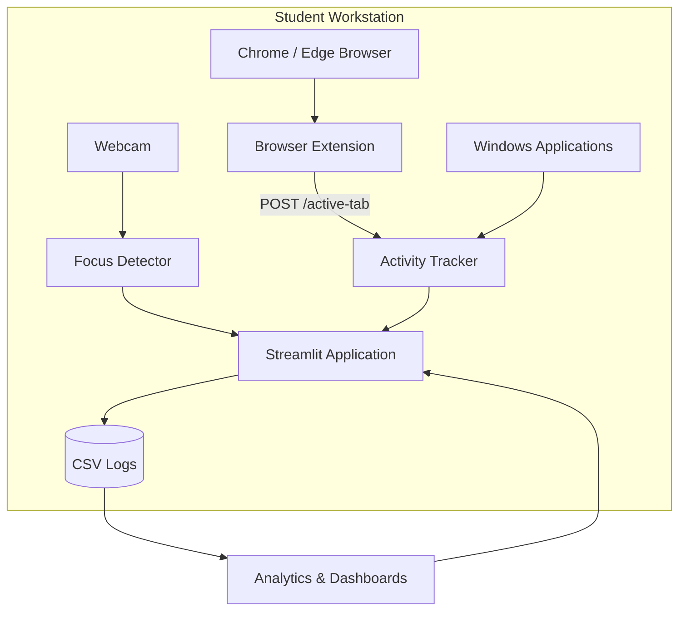

# AI-Enabled Student Focus Monitoring and Study Analytics System

This platform is a local-first study monitoring application that helps students build better focus habits while giving parents and teachers actionable insight into study behavior. The application combines **webcam-based attention detection**, **browser and desktop activity tracking**, **session analytics**, and **role-based reporting dashboards** in a single Streamlit application.

Built with **Python** and **Streamlit**, the application runs entirely on the user's machine. No cloud account or external database is required.

---

## Table of Contents

- [Overview](#overview)
- [Key Features](#key-features)
- [System Architecture](#system-architecture)
- [Technology Stack](#technology-stack)
- [Project Structure](#project-structure)
- [Prerequisites](#prerequisites)
- [Installation](#installation)
- [Usage Guide](#usage-guide)
- [Browser Extension Setup](#browser-extension-setup)
- [Data Storage](#data-storage)
- [How It Works](#how-it-works)
- [Configuration](#configuration)
- [Troubleshooting](#troubleshooting)
- [Limitations](#limitations)
- [Future Enhancements](#future-enhancements)
- [Research Domains](#research-domains)
- [License](#license)

---

## Overview

Online and self-directed learning has made it harder to maintain sustained attention without in-person supervision. This system addresses that gap by using computer vision and behavioral analytics to:

- Estimate whether a student is focused during a study session via webcam input
- Track active browser tabs and Windows applications in real time
- Classify activity as educational or distracting
- Log session and usage data to CSV files for historical analysis
- Generate daily and weekly performance reports for students, parents, and teachers
- Encourage productive study through a tiered reward system

The system is designed for educational and research use in schools, colleges, coaching institutes, and self-study environments.

---

## Key Features

### Real-Time Focus Detection

- Detects face and eyes using OpenCV Haar Cascade classifiers
- Computes Eye Aspect Ratio (EAR) and gaze direction to estimate attention
- Displays a live annotated webcam feed with bounding boxes
- Tracks total study time, focused time, focus rate, EAR, and FPS during active sessions
- Adjustable eye detection sensitivity via in-app settings

### Browser Activity Tracking

- Chrome/Edge extension (Manifest V3) reports the active tab URL and title
- Sends data to a local HTTP endpoint at `http://127.0.0.1:8765/active-tab`
- Captures tab switches, navigation events, and window focus changes
- Polls every 5 seconds as a fallback when events are missed

### System Activity Monitoring

- Polls the active Windows foreground window using `pywin32`
- Records time spent per application and website
- Maintains a switch log of recent platform changes
- Classifies domains and apps as educational or distracting using configurable rule lists

### Study Analytics Dashboard

- **Daily reports** — study hours, focused hours, website extremes, and category breakdowns
- **Weekly reports (5-day window)** — day-by-day trends, totals, and aggregated website usage
- Metrics derived from CSV logs generated at the end of each session

### Parent and Teacher Dashboards

- Separate views for parents and teachers with role-specific login forms
- Look up reports by student name and roll number
- View daily and weekly summaries with focus rate metrics
- Download reports as PDF (requires ReportLab)

### Reward and Engagement System

- Tiered rewards based on focused study time (Bronze through Platinum)
- Activity points model: positive points for focused educational activity, penalties for distractions
- Real-time warnings when switching to non-educational platforms
- Session summary displayed after each study session

### Data Export

- Automatic CSV logging of sessions and website/app usage
- PDF export for activity reports and parent/teacher dashboards

---

## System Architecture



**Session workflow:**

1. Student registers name and roll number, then starts a study session.
2. The webcam captures frames; the focus detector evaluates face, eyes, and gaze.
3. The activity tracker polls the active Windows window and receives browser tab events from the extension.
4. Platforms are classified and time is accumulated per site/app.
5. When the session stops, data is written to CSV files.
6. Analytics and dashboard tabs read from the logs to produce reports.

---

## Technology Stack

| Category | Technologies |
|----------|-------------|
| Language | Python 3.10+ |
| UI Framework | Streamlit |
| Computer Vision | OpenCV (`opencv-python`) |
| Numerical Computing | NumPy |
| PDF Generation | ReportLab |
| System Integration | `psutil`, `pywin32` (Windows active window) |
| Browser Extension | JavaScript, Chrome/Edge Manifest V3 |
| Data Storage | CSV files (local filesystem) |

---

## Project Structure

```text
project/
├── streamlit_app.py              # Main application entry point and UI
├── focus_detector_logic.py       # Webcam focus detection (EAR, gaze, rewards)
├── activity_tracker.py           # Browser + Windows activity tracking and HTTP server
├── study_analytics_dashboard.py  # Daily/weekly analytics and CSV logging
├── parental_teacher_dashboard.py # Parent and teacher report views with PDF export
├── Reward_System.py              # Reserved module (reward logic lives in focus_detector_logic.py)
│
├── study_sessions_log.csv        # Session history (auto-created/updated)
├── website_usage_log.csv         # Website and app usage history
│
├── haarcascade_frontalface_default.xml  # Bundled cascade (OpenCV also ships its own copy)
├── haarcascade_eye.xml
│
├── browser_extension/
│   ├── manifest.json             # Extension configuration (Manifest V3)
│   └── background.js             # Sends active tab data to local server
│
├── requirements.txt
└── README.md
```

### Module Reference

| File | Responsibility |
|------|----------------|
| `streamlit_app.py` | App shell, tab layout, session controls, live stats, PDF activity reports |
| `focus_detector_logic.py` | Face/eye detection, EAR calculation, focus state, reward tiers |
| `activity_tracker.py` | Local HTTP server, Windows app polling, domain classification, points |
| `study_analytics_dashboard.py` | Report builders, CSV persistence, analytics tab UI |
| `parental_teacher_dashboard.py` | Parent/teacher dashboards, student lookup, PDF report generation |

---

## Prerequisites

Before installing, ensure the following:

- **Operating System:** Windows 10 or later (required for desktop activity tracking via `pywin32`)
- **Python:** 3.10 or newer
- **Webcam:** Built-in or external camera with adequate lighting
- **Browser:** Google Chrome or Microsoft Edge (for the optional but recommended extension)
- **Network:** Localhost only — no internet connection is required after dependencies are installed

---

## Installation

### 1. Clone the repository

```bash
git clone https://github.com/your-username/student-focus-monitor.git
cd student-focus-monitor
```

### 2. Create a virtual environment (recommended)

**Windows (PowerShell):**

```powershell
python -m venv venv
.\venv\Scripts\Activate.ps1
```

**Linux / macOS:**

```bash
python3 -m venv venv
source venv/bin/activate
```

> **Note:** Desktop activity monitoring requires Windows. The focus detection and analytics components can be explored on other platforms, but full functionality is Windows-only.

### 3. Install dependencies

```bash
pip install -r requirements.txt
```

### 4. Launch the application

```bash
streamlit run streamlit_app.py
```

Streamlit opens the app in your default browser, typically at `http://localhost:8501`.

---

## Usage Guide

The application is organized into five tabs:

| Tab | Purpose |
|-----|---------|
| **Live Camera Feed** | Register student info, start/stop/reset sessions, view live webcam preview |
| **Statistics & Settings** | Real-time metrics, progress bars, reward tier, EAR/FPS, sensitivity slider |
| **Activity Report** | Current platform, time breakdown, switch log, PDF download |
| **Study Analytics** | Aggregate daily and weekly reports from CSV logs |
| **Parent/Teacher Dashboard** | Role-based student report lookup and PDF export |

### Starting a study session

1. Open the **Live Camera Feed** tab.
2. Enter **Student Name** and **Roll Number**, then click **Register**.
3. Install and enable the browser extension (see below) for accurate website tracking.
4. Click **Start Session** and allow webcam access when prompted.
5. Study while the app monitors focus and activity in the background.
6. Click **Stop Session** when finished. Session data is saved automatically to CSV.

### Viewing reports

- Use **Study Analytics** for general daily/weekly summaries across all logged sessions.
- Use **Parent/Teacher Dashboard** to filter reports by a specific student's name and roll number.
- Download PDF reports from the Activity Report tab or the Parent/Teacher Dashboard when ReportLab is installed.

---

## Browser Extension Setup

The browser extension sends active tab information to the Python backend. Without it, website tracking falls back to Windows window title polling, which is less precise for browser-based study.

### Install the extension

1. Open `chrome://extensions` (Chrome) or `edge://extensions` (Edge).
2. Enable **Developer mode**.
3. Click **Load unpacked**.
4. Select the `browser_extension/` folder from this project.
5. Keep the Streamlit app running so the local server on port `8765` is available.

### Extension behavior

- Listens for tab activation, navigation, and window focus changes
- POSTs JSON payloads to `http://127.0.0.1:8765/active-tab`
- Silently ignores connection errors when the Python app is not running

---

## Data Storage

All data is stored locally in CSV files at the project root.

### `study_sessions_log.csv`

| Column | Description |
|--------|-------------|
| `date` | Session date (ISO format) |
| `session_start` | Session start timestamp |
| `session_end` | Session end timestamp |
| `total_study_sec` | Total session duration in seconds |
| `total_focused_sec` | Time classified as focused, in seconds |
| `student_name` | Registered student name |
| `roll_number` | Registered roll number |

### `website_usage_log.csv`

| Column | Description |
|--------|-------------|
| `date` | Usage date (ISO format) |
| `label` | Domain, app name, or platform label |
| `kind` | Activity type (`website`, `app`, or `unknown`) |
| `seconds` | Time spent on the platform |
| `is_educational` | `1` for educational, `0` for non-educational |
| `student_name` | Associated student name |
| `roll_number` | Associated roll number |

---

## How It Works

### Focus detection

The system estimates attention using classical computer vision — no deep learning models are used.

1. **Face detection** — Haar Cascade classifier locates the largest face in the frame.
2. **Eye detection** — Eyes are detected within the face region of interest.
3. **Eye Aspect Ratio (EAR)** — Vertical and horizontal eye distances are compared; lower EAR suggests closed or drowsy eyes.
4. **Gaze estimation** — Face horizontal position is compared to the frame center to detect looking away.
5. **Focus decision** — A confidence score combines open eyes, eye symmetry, and forward gaze. Focus state uses a short frame threshold to reduce flicker.

Configurable parameters include the EAR threshold (default `0.18`) and the focus frame threshold.

### Activity tracking

The `ActivityTracker` runs a background thread that:

- Polls the active Windows foreground window every second
- Receives browser tab updates from the extension HTTP server
- Accumulates time per platform and logs switch events
- Applies rule-based classification using domain and executable name lists

**Default educational domains:** Coursera, GeeksforGeeks, Khan Academy, LeetCode, Stack Overflow, Wikipedia

**Default distraction domains:** YouTube, Facebook, Instagram, TikTok

**Default educational apps:** VS Code, PyCharm, Notepad++, Word, PowerPoint, Adobe Acrobat

Lists can be extended in `activity_tracker.py`.

### Reward mechanism

Focused study time maps to reward tiers:

| Focused Time | Tier |
|-------------|------|
| ≥ 0.8 min | Bronze |
| ≥ 1.0 min | Silver |
| ≥ 1.4 min | Gold |
| ≥ 1.8 min | Platinum |

Activity points increase during focused educational use and decrease when switching to distracting platforms. Warnings are shown in the Activity Report tab when distractions are detected.

---

## Configuration

| Setting | Location | Default | Description |
|---------|----------|---------|-------------|
| EAR threshold | Statistics & Settings tab | `0.18` | Eye closure sensitivity (lower = more sensitive) |
| HTTP server port | `activity_tracker.py` | `8765` | Port for browser extension POST requests |
| Poll interval | `activity_tracker.py` | `1.0` sec | Windows active window polling rate |
| Extension poll interval | `background.js` | `5` sec | Backup tab polling interval |
| Webcam display size | `streamlit_app.py` | `1080×580` px | Preview dimensions in the UI |

---

## Troubleshooting

| Issue | Possible cause | Solution |
|-------|---------------|----------|
| Webcam not detected | Camera in use by another app or blocked by OS | Close other camera apps; grant browser/OS camera permissions |
| Extension not sending data | App not running or port blocked | Start Streamlit first; confirm nothing else uses port `8765` |
| No website data in reports | Extension not installed | Load the unpacked extension and browse during a session |
| PDF download unavailable | ReportLab not installed | Run `pip install reportlab` |
| Focus detection inaccurate | Poor lighting or low camera quality | Improve lighting; adjust EAR sensitivity slider |
| Activity shows wrong app | Browser without extension | Install extension or rely on window title fallback |
| Empty analytics | No completed sessions logged | Complete at least one session with Stop (not just browser close) |

---

## Limitations

- **Platform support:** Full desktop activity tracking is Windows-only.
- **Camera dependency:** Focus accuracy depends on lighting, camera quality, and face visibility.
- **Rule-based classification:** Website and app categories use static lists, not machine learning.
- **Local storage only:** Data is stored in CSV files with no cloud sync or multi-user authentication.
- **Classical CV only:** Haar Cascades and EAR are less robust than modern deep-learning gaze models.
- **Single-face assumption:** Only the largest detected face is tracked per frame.
- **Privacy:** Webcam and activity data remain on the local machine; deploy responsibly with informed consent.

---

## Future Enhancements

- Deep learning-based gaze and attention estimation (e.g., MediaPipe, transformer models)
- Cross-platform desktop activity support (macOS, Linux)
- Cloud database and multi-student deployment
- Personalized study recommendations based on historical patterns
- Learning Management System (LMS) integration
- Mobile companion app for notifications and summaries
- Configurable session duration limits and study goals
- Enhanced authentication for parent/teacher dashboards

---

## Research Domains

This project intersects several academic and applied fields:

- Artificial Intelligence and Computer Vision
- Learning Analytics and Educational Technology (EdTech)
- Human-Computer Interaction (HCI)
- Behavioral Science and Productivity Research

---

## License

This project is developed for **educational and research purposes only**.

---

## Acknowledgments

This project uses [OpenCV](https://opencv.org/) Haar Cascade classifiers for face and eye detection, [Streamlit](https://streamlit.io/) for the web interface, and [ReportLab](https://www.reportlab.com/) for PDF report generation.
